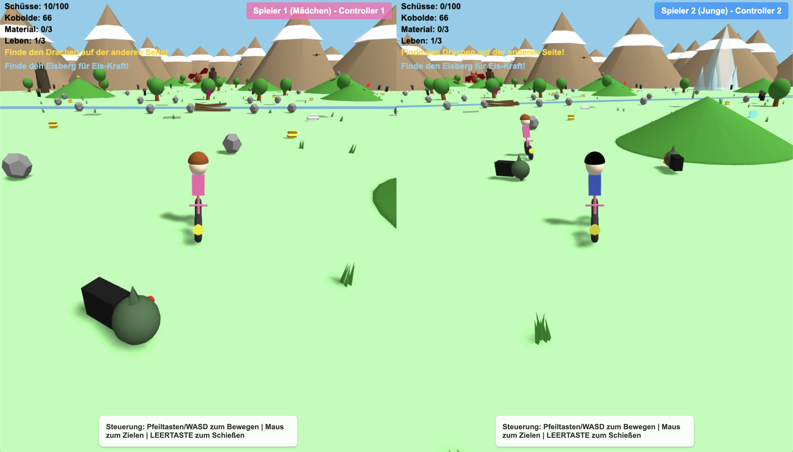

# Fahrrad-Abenteuer 🚲

A 3D bicycle adventure game built with Three.js where you navigate terrain, collect materials, repair bridges, defeat enemies, and reach the treasure.



## 🎮 How to Play

### Play Now (Easiest Way)
**Just click this link to play instantly in your browser:**

**Play Fahrrad-Abenteuer Now!**

👉 **[One player](https://raw.githack.com/flash1293/rainbow-hunter/main/index.html)** 👈

👉 **[Splitscreen](https://raw.githack.com/flash1293/rainbow-hunter/main/splitscreen.html)** 👈

No installation, no setup needed!

### Play Locally
Download or clone this repository and open `index.html` in any modern web browser. That's it!

```bash
# Clone the repo
git clone https://github.com/flash1293/rainbow-hunter.git
cd rainbow-hunter

# Open index.html in your browser
# Or serve with a local server (for best results):
python -m http.server 8000
# Then visit http://localhost:8000
```

## Project Structure

```
eat-the-rainbow/
├── index.html              # Main HTML entry point
├── style.css               # Styles and difficulty menu
├── js/                     # Modular game code (NEW!)
│   ├── main.js            # Main game orchestration and initialization (44,144 lines)
│   ├── config.js          # Game configuration and constants (8,527 lines)
│   ├── terrain.js         # Terrain generation and procedural textures (7,847 lines)
│   ├── audio.js           # Audio system (music and sound effects)
│   └── multiplayer.js     # PeerJS-based multiplayer synchronization
└── README.md              # This file
```

## Module Overview

### `js/main.js`
Main game file that orchestrates all systems. Handles:
- Game initialization and difficulty selection
- Scene setup (Three.js, camera, lighting)
- Game loop and state management
- HUD rendering with health, ammo, materials, and cooldowns
- Multiplayer synchronization (PeerJS)

### `js/config.js`
Central configuration file containing:
- Game constants (speeds, ranges, limits)
- Terrain data (hills, mountains, trees, rocks)
- Goblin spawn positions
- Treasure location
- Difficulty settings
- World boundaries

### `js/audio.js`
Complete audio system with:
- Sound effects (shooting, explosions, collecting, death, etc.)
- Background music generation (42-note melody)
- Bike engine sounds
- Goblin proximity audio
- Audio context management

### `js/terrain.js`
Terrain and environment utilities:
- Height calculation for hills
- Mesh generation for terrain features (trees, rocks, grass)
- Mountains (world boundaries with 3-area progression)
- River and bridge creation

### Player System (in `main.js`)
Player logic implemented directly in main.js:
- Keyboard and mouse controls (WASD + Arrow keys + Mouse look)
- Player mesh creation (bike + rider, boat for water level)
- Movement, rotation, and gliding mechanics
- Terrain height following
- God mode for testing (G key)
- Multiplayer differentiation (host/client colors)

### Goblin System (in `main.js`)
Goblin entity system implemented directly in main.js:
- Regular goblin creation with AI (shark fins for water level)
- Giant goblins with special attacks
- Guardian goblin creation (elite enemies with bows, octopuses for water level)
- Wizard, mummy, and lava monster variants
- AI behavior (patrol, chase, attack)
- Collision and trap detection
- Freeze power effects
- Dragon boss with fireballs and 50 HP

## Game Features

### Difficulty Levels
- **Leicht (Easy)**: 20 regular goblins, normal speeds, no guardians, no dragon
- **Schwierig (Hard)**: 53 regular goblins + 12 elite guardians + dragon boss, 50% faster, arrow attacks, fireballs

### Map Layout
The game features a 3-area progression system:
1. **Front Area (Spawn)**: Starting zone with regular goblins
2. **Middle Area**: Guardian territory with elite enemies (hard mode)
3. **Dragon Arena**: Final boss area with the dragon (hard mode) and treasure

### Controls
- **WASD / Arrow Keys**: Move and turn
- **Mouse**: Aim and look around (click to lock cursor)
- **Space**: Shoot
- **F**: Freeze power (10-second cooldown)
- **R**: Restart after death/victory
- **G**: God mode (testing only - unlimited ammo, invincibility, flight)
- **Q/E**: Fly up/down in god mode

### Gameplay
1. Collect materials scattered across the world
2. Avoid or shoot goblins (use freeze power strategically)
3. Repair the bridge with collected materials
4. Cross the river to the middle area
5. Defeat guardian goblins and their arrows (hard mode only)
6. Navigate through the second gap to the dragon arena
7. Defeat the dragon boss with 50 health (hard mode only)
8. Reach the treasure to win

### Special Features
- **Ice Power**: Freeze enemies in a radius for 5 seconds (10-second cooldown)
- **Dragon Boss** (Hard Mode): 
  - 50 health points
  - Breathes fireballs (2 damage each)
  - Contact damage (1 damage)
  - Flying behavior
  - Tracks and faces the player
  - Spectacular explosion death animation
- **Giant Goblins**: Special enemies with ground-shaking attacks
- **Multiplayer Support**: Play with a friend via PeerJS connection
- **Environmental Decoration**: Dense forests, rocks, hills, and grass throughout all areas

## Technical Details

- **Engine**: Three.js r128
- **Multiplayer**: PeerJS for peer-to-peer connections (host-authoritative, 20Hz sync)
- **Architecture**: Traditional script loading with separated concerns
- **Rendering**: WebGL with shadow mapping and emissive materials
- **Audio**: Web Audio API with procedural sound generation
- **Input**: Pointer Lock API for FPS-style mouse control
- **World Size**: 300x300 units with dynamic terrain generation

## Development

The codebase uses traditional script loading for browser compatibility:
- Configuration is centralized in `config.js`
- Audio system is completely isolated in `audio.js`
- Terrain generation and textures in `terrain.js`
- Multiplayer system with full game state synchronization in `multiplayer.js`
- Main game logic in `main.js` for easy browser execution
- Easy to extend with new features
- Supports direct `file:///` execution without a web server

### Recent Additions
- Dragon boss with detailed model (scales, teeth, wings, tail, pupils)
- Ice/freeze power system with cooldown
- God mode for testing and debugging
- Multiplayer support for 2 players
- Dense environmental decoration (trees, rocks, hills, grass)
- 3-area map progression system
- Gliding mechanics for the player

**Note**: The game uses `js/main.js` as the entry point and runs directly in modern browsers.

## Browser Compatibility

Works in all modern browsers that support:
- WebGL
- Web Audio API
- Pointer Lock API
- JavaScript ES6 syntax

Tested on Chrome, Firefox, Safari, and Edge.
